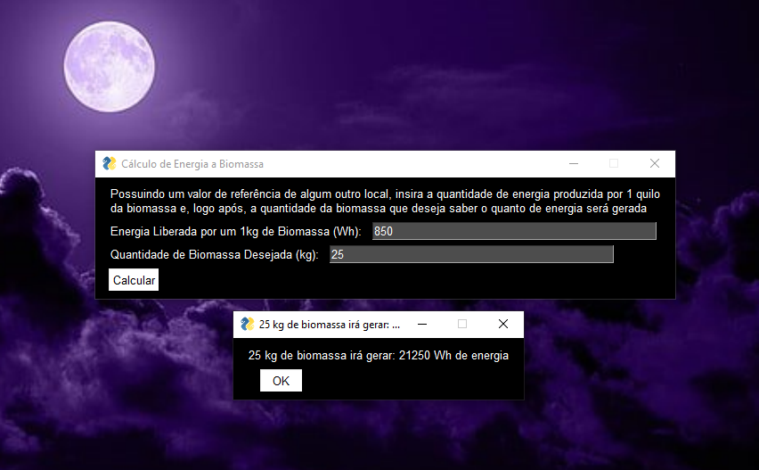

# Cálculo de Energia e Biomassa 

## Calculadora 
Este é um programa capaz de calcular a quantidade de energia que seria capaz de ser gerada por uma determinada quantidade de biomassa, através de valores referenciais que são pesquisados e testados.

Então, por exemplo, baseado em dados testados pela Universidade Estadual do Centro-Oeste (Unicentro), sabemos que 1 tonelada de celulose produz 850 kWh de energia, logo, 1 quilo produz 850 Wh. Com este valor, é inserido no primeiro campo de texto do aplicativo que é produzido 850 Wh com um 1 quilo e, no segundo campo de texto, deve ser inserido a quantidade (em quilos) de biomassa que deseja descobrir quanto de energia gera. 

Supondo que queremos saber quanto de energia será gerada por 25 quilos de celulose sabendo que 1 quilo gera 850 Wh, vai ser inserido no aplicativo e ele fará uma regra de 3 simples:

01 kg ------ 850 Wh 
25 kg ------ x Wh 

x = 850.25 = 21250 Wh 

Veja a prática do aplicativo:

## Conversor 
Há também, um conversor junto, que possui a função de capturar um valor energético e converter em outros tipos, transitando entre quilowatt hora (kWh), watt hora (Wh), joule (J), quilojoule (kJ), caloria (cal) e quilocaloria (kCal).

Por exemplo, utilizando o valor anterior de 850Wh e inserindo no aplicativo, será obtido como resultado:

> 850 Wh
> 0,85 kWh
> 3060000 J 
> 3060 kJ
> 731340 cal 
> 731,34 kCal 